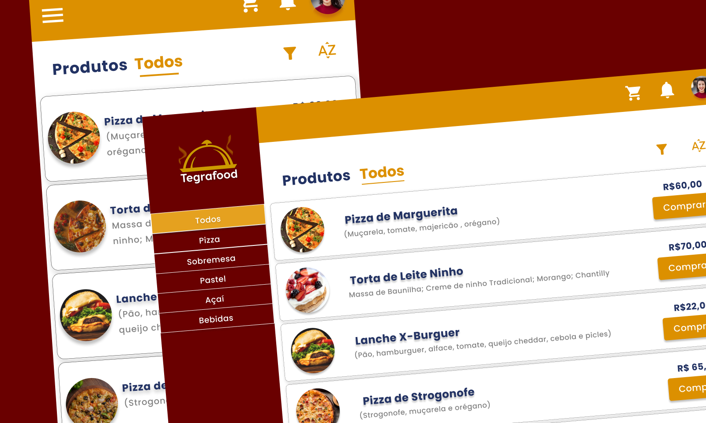

# Traco Tech - Tegrafood 

O Tegrafood é um projeto simulado proposto pela [Traco Tech](https://tracotech.com.br) que permite o gerenciamento dos produtos de um estabelecimento de fast food. Foram desenvolvidos o [front-end](https://github.com/rodolfosouzamenezes/tegrafood/tree/master/front-end) e [back-end](https://github.com/rodolfosouzamenezes/tegrafood/tree/master/back-end) do projeto. Para ver o [projeto finalizado, clique aqui](https://tegrafood.vercel.app/).

## Sobre a Traco Tech - New Dev( )
Este projeto é parte do processo de seleção do Programa Jovens Tegranos, uma iniciativa da empresa [Tegra](https://tegra.com.br) que tem como objetivo formar e capacitar jovens talentos na área de tecnologia. A Traco Tech possui o curso [New Dev( )](https://tracotech.com.br/new-dev/), no qual são ensinados conceitos de Soft Skills, Lógica de Programação, JavaScript, HTML e CSS.

## Documentação
Separei a documentação em duas partes, para ficar mais simples de entender: [Front-end](https://github.com/rodolfosouzamenezes/tegrafood/tree/master/front-end) e [Back-end](https://github.com/rodolfosouzamenezes/tegrafood/tree/master/back-end).