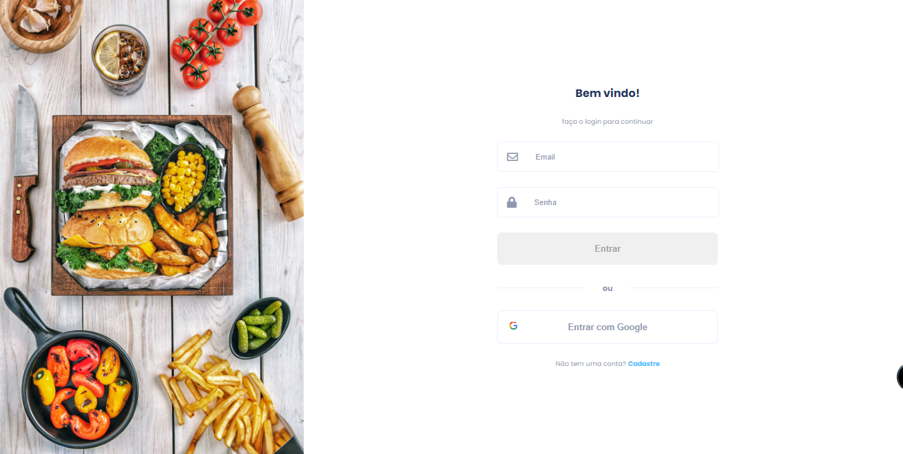
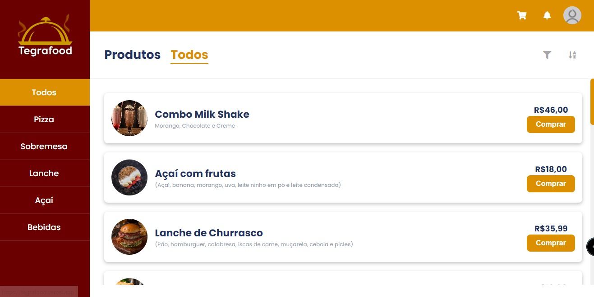
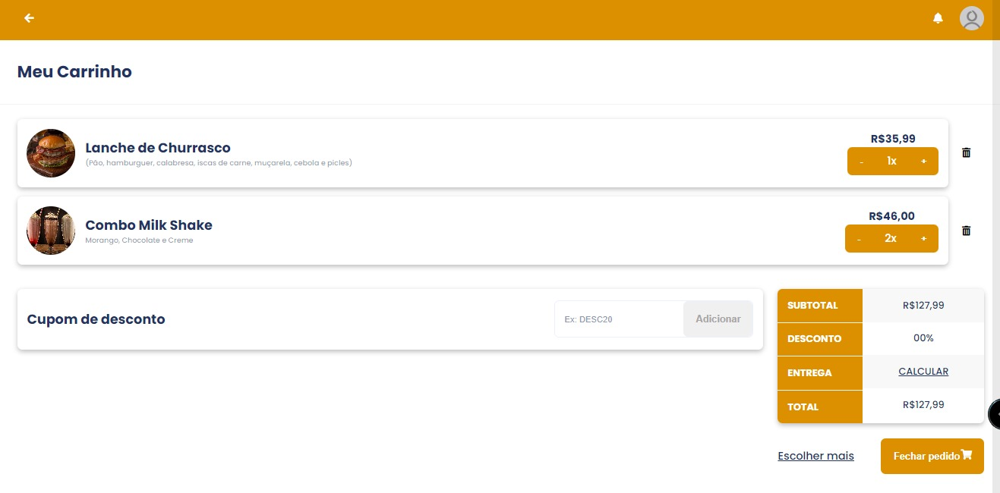
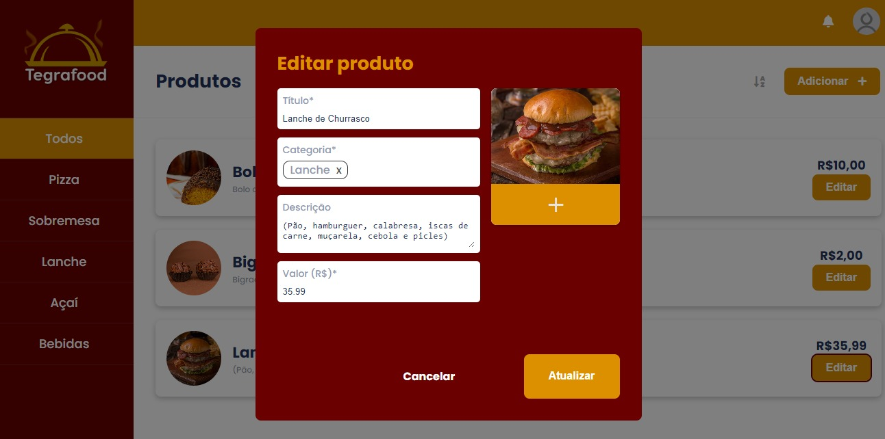
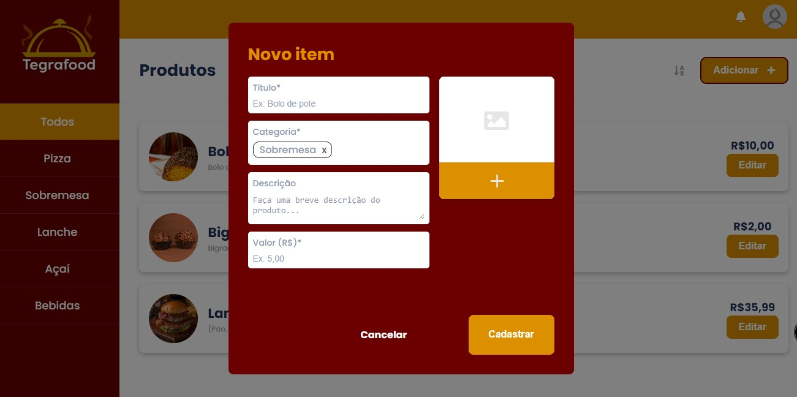

## Tecnologias: HTML, CSS E JS
LINK DO DEPLOY: https://tegrafood.vercel.app/

## Autenticação

A autenticação do usuário é realizada nas telas de login ou cadastro. Após inserir os dados corretamente, o usuário recebe um token que será utilizado para acessar as próximas telas. Esse token possibilita o login automático, sem a necessidade de inserir novamente as informações de login em cada sessão. Caso o usuário tente acessar uma tela que necessita de autenticação e não esteja cadastrado, ele será redirecionado para a tela de login.

Além disso, a autenticação permite identificar se o usuário é administrador ou não, possibilitando acesso a telas e funcionalidades específicas.

## Listagem de Produtos

Na página inicial do site, é apresentada uma lista de produtos que pode ser filtrada por categoria. Utilizei a estratégia de passar o código da categoria pela URL (por exemplo: https://tegrafood.vercel.app/?category=3), permitindo que o usuário compartilhe o link de uma categoria específica. Além disso, é possível filtrar os produtos por preço e ordenar a lista em ordem alfabética, crescente ou decrescente. Também é possível adicionar os produtos ao carrinho de compras.

## Listagem de Produtos do Carrinho

No carrinho é possível editar a quantidade de produtos e removê-los. Além disso, é possível adicionar um cupom de desconto utilizando um código com a seguinte estrutura: DESC + dois dígitos representando a porcentagem (por exemplo: DESC05).

Na tabela é exibida informações como o subtotal, que é a soma dos valores dos produtos, o desconto, que é a porcentagem de desconto definida pelo cupom, e a entrega, que é calculada ao clicar no botão "CALCULAR" e adiciona um valor fictício de frete.

O total é calculado pela equação __(Subtotal - (Subtotal x (Desconto / 100))) + Entrega__. Ao clicar em "Fechar pedido", o carrinho é esvaziado e todos os produtos são removidos.

## Listagem de Produtos (ADM)

Para criar um usuário administrador, é necessário utilizar um endereço de e-mail com o domínio "@tegrafood.com". No entanto, atualmente não é possível cadastrar novos produtos por meio da interface, pois houve dificuldades em realizar o upload de arquivos para a API. No entanto, é possível realizar o cadastro e edição dos produtos utilizando o backend, por meio do uso de ferramentas como Insomnia ou Postman.

